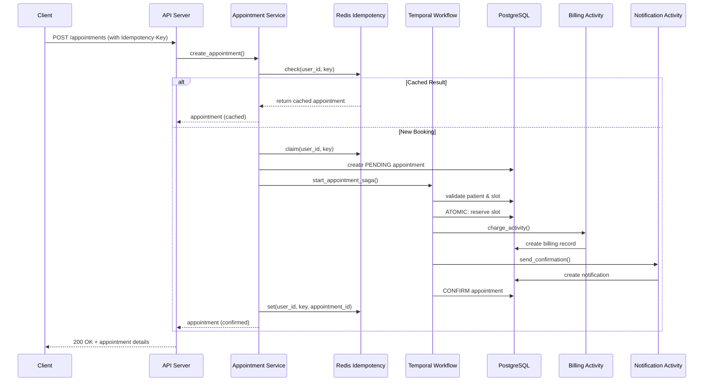
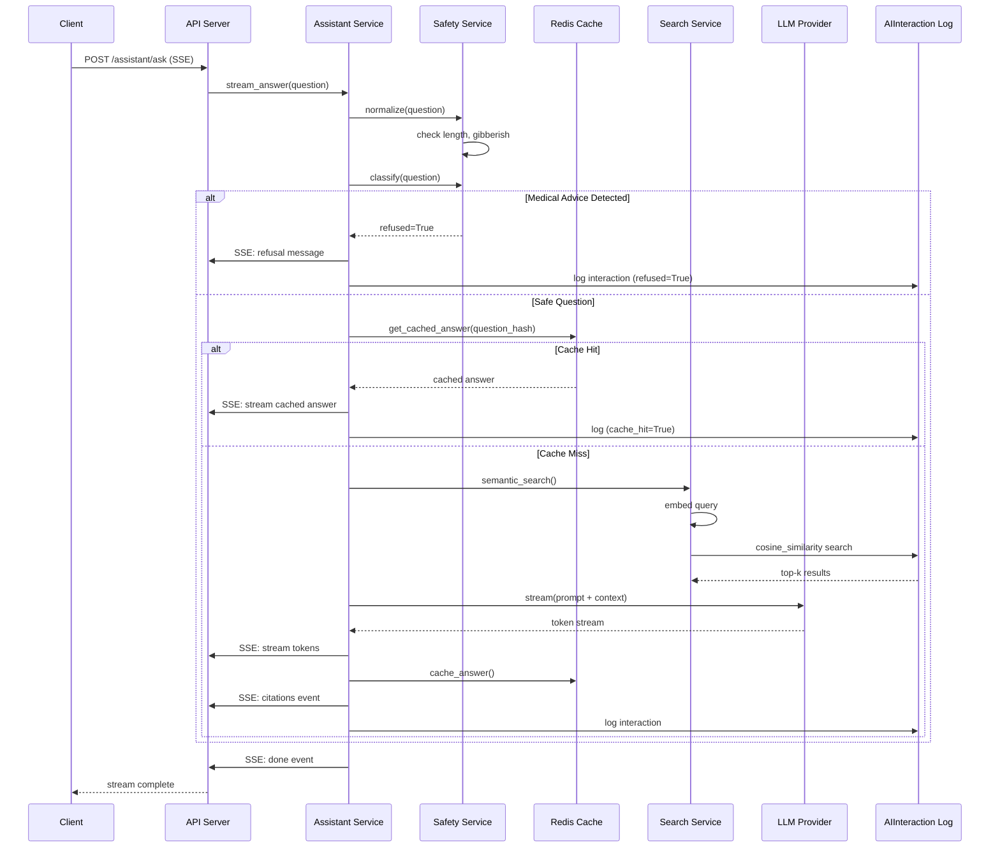
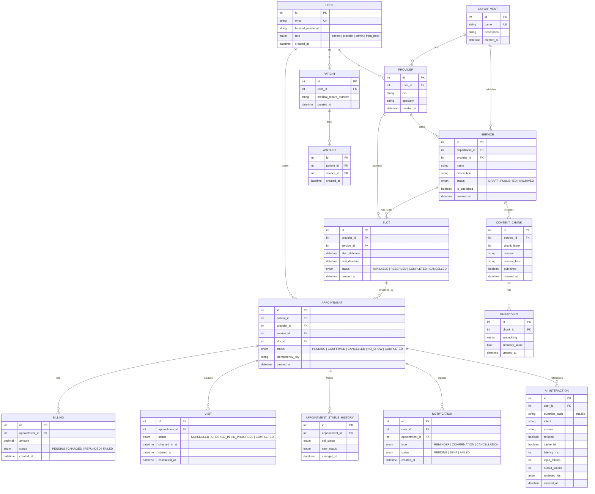
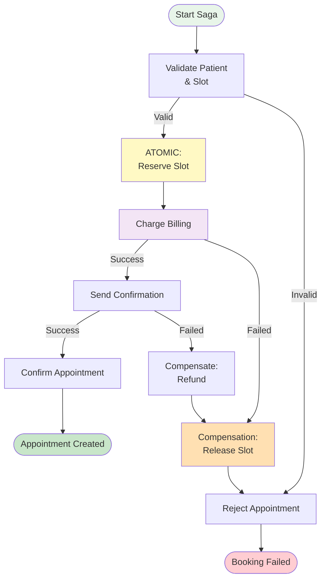

# SmartHealth Backend Architecture

## Purpose and Scope

SmartHealth is a single-clinic healthcare operations backend. It provides authenticated APIs for patient access, provider scheduling, service discovery, appointments, billing pre-checks, visit progression, notifications, analytics, and a safety-first assistant.

This document describes backend runtime and ownership boundaries. PostgreSQL is the system of record. Redis, Temporal, Kafka, Celery, and model providers support the system but do not replace its transactional source of truth.

## Architectural Boundaries

```mermaid
graph TB
    subgraph API["API Layer (FastAPI)"]
        Auth["Authentication"]
        Endpoints["REST Endpoints"]
        Assistant["AI Endpoints<br/>Search, Assistant, Generation<br/>SSE"]
        Middleware["Middleware<br/>Correlation ID, Metrics, CORS"]
    end
    
    subgraph Services["Service Layer"]
        AppService["Appointment Service"]
        AuthService["Auth Service"]
        HealthService["Healthcare Event Service"]
        AssistantService["Assistant Service<br/>Navigation, Preparation, Availability"]
        SearchService["Search Service<br/>Grounded Results"]
        GenerationService["Communication Service<br/>Summary, Follow-up, Reports"]
    end
    
    subgraph Workflow["Workflow Orchestration (Temporal)"]
        AppointmentSaga["Appointment Saga"]
        ServicePublish["Service Publish Workflow"]
        Activities["Activities<br/>Billing, Notification, Slot, etc."]
    end
    
    subgraph Workers["Background Workers"]
        Celery["Celery Workers<br/>Task Queue"]
        KafkaConsumer["Kafka Analytics Consumer"]
        TemporalWorker["Temporal Worker"]
    end
    
    subgraph Persistence["Data Persistence"]
        PostgreSQL["PostgreSQL<br/>Domain Models, Audit"]
        Redis["Redis<br/>Idempotency, Caching<br/>Rate Limiting"]
        Kafka["Kafka<br/>Event Stream"]
    end
    
    subgraph Safety["AI Safety & Compliance"]
        SafetyService["Safety Service<br/>Refusal Detection"]
        PHIProtection["PHI Protection<br/>Question Hashing<br/>Response Redaction"]
        FakeLLM["FakeLLM<br/>Offline Testing"]
    end
    
    subgraph External["External Services"]
        LLM["LLM Provider<br/>Groq/OpenAI-compatible"]
        EmbeddingProvider["Embedding Provider<br/>HuggingFace"]
    end
    
    subgraph Monitoring["Observability"]
        Logs["Structured Logs<br/>JSON, Correlation ID"]
        Metrics["Prometheus Metrics"]
        Interactions["AI Interactions DB<br/>Audit & Analytics"]
    end
    
    Caller[Authenticated API caller] -->|REST + SSE| API
    API -->|Routing| Endpoints
    API -->|SSE: text/results, metadata, citations, done| Assistant
    Endpoints -->|Business Logic| Services
    Assistant -->|Question Processing| AssistantService
    AssistantService -->|Safety Check| SafetyService
    AssistantService -->|Cache/LLM| Redis
    AssistantService -->|Semantic Search| SearchService
    AssistantService -->|LLM Call| LLM
    Endpoints -->|SSE generation| GenerationService
    GenerationService -->|Grounded data| PostgreSQL
    GenerationService -->|Optional drafting| LLM
    AssistantService -->|Log Interaction| Interactions
    Services -->|Orchestrate| Workflow
    Workflow -->|Execute| Activities
    Activities -->|Database Access| PostgreSQL
    Services -->|Repository Pattern| PostgreSQL
    Services -->|Publish Events| Kafka
    Services -->|Idempotency| Redis
    Services -->|Rate Limit| Redis
    Celery -->|Background Tasks| PostgreSQL
    Celery -->|Publish Events| Kafka
    KafkaConsumer -->|Consume Events| Kafka
    KafkaConsumer -->|Store Analytics| PostgreSQL
    TemporalWorker -->|Run Workflows| Workflow
    SafetyService -->|Classification| AssistantService
    PHIProtection -->|Hash/Redact| AssistantService
    FakeLLM -->|Mock Responses| AssistantService
    EmbeddingProvider -->|Embeddings| SearchService
    PostgreSQL -->|Metrics| Metrics
    Services -->|Logs| Logs
    Workflow -->|Logs| Logs
    Celery -->|Logs| Logs
    KafkaConsumer -->|Logs| Logs
    
    style Caller fill:#e1f5ff
    style API fill:#fff3e0
    style Services fill:#f3e5f5
    style Workflow fill:#e8f5e9
    style Workers fill:#fce4ec
    style Persistence fill:#ede7f6
    style Safety fill:#fff9c4
    style External fill:#ffebee
    style Monitoring fill:#e0f2f1
```

## Request Flow: Appointment Booking

Clients create appointments directly with `POST /appointments`. Slot reservation is an internal step of the appointment saga; clients should not reserve a slot first and then create an appointment. If no slot is available, the waitlist flow is used instead.

## Request Flow: AI Assistant Query

## Data Model: Key Entities

## Temporal Workflow: Appointment Saga with Compensation

