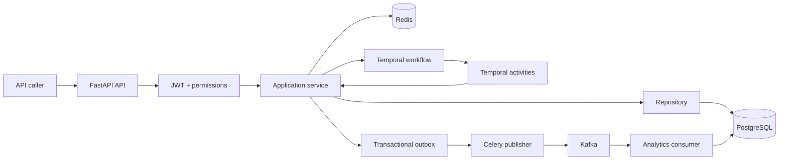

# SmartHealth Backend Presentation Guide

## 1. One-sentence project explanation

SmartHealth is a backend healthcare operations system that protects patient data, prevents double booking, and uses durable workflows for operations that involve several steps or systems.

A simple sentence to say:

> The API receives a business request, services apply the rules, PostgreSQL stores the truth, and workers handle durable or asynchronous work without duplicating the business logic.

## 2. The backend in one picture

## 3. The golden rule: who owns what?

| Part | Easy explanation | Open this file |
| --- | --- | --- |
| API | Receives HTTP requests and returns responses | `app/api/v1/endpoints/` |
| Schema | Validates request and response shapes | `app/schemas/` |
| Service | Decides what the business operation means | `app/services/` |
| Repository | Reads and writes PostgreSQL | `app/repositories/` |
| Model | Defines database tables and relationships | `app/models/` |
| Temporal workflow | Coordinates a long multi-step operation | `app/workers/temporal/workflows/` |
| Temporal activity | Performs one side-effecting step | `app/workers/temporal/activities/` |
| Celery task | Runs a retryable background job | `app/workers/celery/` |
| Kafka consumer | Receives events and updates analytics | `app/workers/kafka/consumer.py` |
| Event envelope | Defines safe event metadata | `app/events/envelopes.py` |
| Migration | Evolves the database schema | `alembic/versions/` |

## 4. Workflow 1: patient booking

### What the user sees

A patient chooses an available slot and submits a booking request.

### What the backend does

1. The appointment endpoint authenticates the JWT and checks permission.
2. `AppointmentService` finds the patient profile from the authenticated user. It does not trust a patient ID from the caller.
3. Redis checks the `Idempotency-Key`. A retry returns the original result instead of creating a duplicate.
4. The service validates the slot and starts `AppointmentSagaWorkflow`.
5. The workflow validates the appointment data.
6. It reserves the slot with an atomic database operation. Two patients may race, but only one update can change `AVAILABLE` to reserved.
7. It creates the pending appointment and records status history.
8. It runs the billing pre-check.
9. It schedules the reminder notification.
10. It confirms the appointment and queues the domain event.
11. The API returns the appointment result.
12. If a later step fails, compensation releases the slot, cancels the pending appointment, cancels the reminder, and preserves the history.

### Why Temporal is used here

Booking is not one database insert. It is a business transaction spread across reservation, billing, notification, confirmation, and event publication. Temporal remembers which steps completed, retries safe activities, and runs compensation after failure. The API process can restart without losing the workflow state.

### Files to open during the presentation

1. `app/api/v1/endpoints/appointments.py`
2. `app/services/appointment_service.py`
3. `app/workers/temporal/workflows/appointment_saga.py`
4. `app/workers/temporal/activities/appointment_saga.py`
5. `app/workers/temporal/activities/scheduling_activities.py`
6. `app/repositories/slots.py`
7. `app/repositories/appointments.py`
8. `app/workers/temporal/policies.py`

### One important sentence

> Temporal coordinates the booking; the service owns the business rules; the repository and PostgreSQL own correctness.

## 5. Workflow 2: service publication and search

### What the user sees

A staff member creates a clinic service and publishes it so it can be found by search and used for availability questions.

### What the backend does

1. The service starts in a draft state.
2. `ServicePublishWorkflow` calls the validation activity.
3. The service is moved to publishing.
4. The description and preparation instructions are structured.
5. The text is split into searchable chunks.
6. Chunks are embedded using the configured embedding provider.
7. Existing unchanged chunks can reuse their content hash and embedding.
8. The chunks are persisted atomically.
9. The service is marked published and the publication event is queued.
10. Search reads only chunks and services that are both published.

### Why Temporal is used here

Embedding calls and persistence can take time and can fail independently. Temporal gives the operation durable progress, retries, and a visible status such as validating, structuring, embedding, persisting, or complete. A failed publication is marked failed and can be retried without leaving duplicate chunk indexes.

### Files to open during the presentation

1. `app/api/v1/endpoints/services.py`
2. `app/services/service_management.py`
3. `app/services/service_publish_service.py`
4. `app/workers/temporal/workflows/service_publish.py`
5. `app/workers/temporal/activities/service_publish.py`
6. `app/services/embedding_service.py`
7. `app/repositories/content_chunks.py`
8. `app/services/search_service.py`

## 6. Workflow 3: event publication through the outbox

### What the user sees

Usually nothing directly. Events allow analytics and other backend processes to react to committed business changes.

### What the backend does

1. A service commits a business mutation.
2. The same transaction stores an outbox row with the event ID and safe payload.
3. A Celery task reads pending outbox rows.
4. The Kafka publisher sends the immutable event envelope.
5. The row is marked published only after the send succeeds.
6. Temporary failures retry with bounded backoff.
7. The analytics consumer validates the payload and records the event ID.
8. A repeated event ID is ignored, so analytics are not counted twice.

### Why Celery and Kafka are used here

Kafka distributes events to independent consumers. Celery runs the publisher as a retryable background job. The outbox prevents a Kafka outage from losing a business event after PostgreSQL has committed the appointment or service change.

### Files to open during the presentation

1. `app/services/healthcare_event_service.py`
2. `app/models/outbox.py`
3. `app/repositories/outbox.py`
4. `app/workers/celery/outbox.py`
5. `app/workers/kafka/producer.py`
6. `app/events/envelopes.py`
7. `app/workers/kafka/consumer.py`
8. `app/repositories/analytics.py`

### One important sentence

> The database commits the truth first; the outbox guarantees that the event can be delivered later.

## 7. Workflow 4: visit lifecycle

### What the user sees

Front-desk or provider staff move a visit through check-in, in-progress, and completed states.

### What the backend does

1. The endpoint authenticates and checks the actor's permission.
2. The service checks the current appointment and visit state.
3. It allows only a valid next transition.
4. It writes the new state and status history.
5. It records an audit event.
6. It publishes a visit-status event for analytics.

### Why this is not a Temporal workflow

A visit transition is a short, transactional state change. It does not need a long-running workflow. The service and database transaction are the correct tool. Temporal is reserved for multi-step work that may pause, retry, or compensate.

### Files to open

1. `app/api/v1/endpoints/appointments.py`
2. `app/services/appointment_service.py`
3. `app/models/visit.py`
4. `app/models/appointment.py`
5. `app/repositories/appointments.py`
6. `app/core/authorization/policies.py`

## 8. Workflow 5: AI assistant

### What the user sees

A user asks about services, availability, preparation, or their own appointments.

### What the backend does

1. The API authenticates the user.
2. The safety layer normalizes the question and identifies unsafe medical advice.
3. Unsafe diagnosis, treatment, medication, and emergency questions are refused before model execution.
4. For a safe question, the service retrieves authorized context.
5. Personal appointment context is limited to the signed-in user's records.
6. Published service context comes from the catalog and vector search.
7. The real configured LLM composes the natural-language answer.
8. The response streams as text and citations.
9. The interaction stores safe telemetry, redacted answer data, and correlation metadata.

### Why the safety response is hard-coded

A safety refusal is a policy boundary, not a creative answer. The model must not be allowed to decide whether an emergency is safe. For normal questions, the LLM is used as the conversational layer; the backend supplies the facts and authorization boundary.

### Files to open

1. `app/api/v1/endpoints/assistant.py`
2. `app/services/assistant_service.py`
3. `app/services/safety_service.py`
4. `app/services/assistant_prompts.py`
5. `app/services/llm_provider.py`
6. `app/services/patient_context_service.py`
7. `app/services/search_service.py`
8. `app/models/ai_interaction.py`

## 9. Why these technologies were selected

### FastAPI

FastAPI provides typed HTTP contracts, dependency injection, authentication integration, and clear route documentation. It is the boundary between an API caller and the application services.

### PostgreSQL

PostgreSQL is authoritative because booking needs atomic updates, unique constraints, transactions, audit history, and reliable relational queries. It also supports vector storage for catalog retrieval.

### SQLAlchemy and repositories

SQLAlchemy maps domain objects to tables. Repositories centralize queries and writes so services do not contain scattered SQL or accidental authorization gaps.

### Redis

Redis is used for fast, expiring coordination: idempotency keys, answer caching, and rate limits. It is not the source of truth for appointments.

### Temporal

Temporal is selected for durable workflows. It remembers workflow progress across process restarts, retries activities, and supports compensation. It is especially appropriate for booking and service publication.

### Celery

Celery is selected for independent background jobs with bounded retry behavior, such as publishing pending outbox events. It is simpler than a workflow engine when there is no multi-step business state machine.

### Kafka

Kafka is selected for durable event distribution and multiple consumers. Analytics can consume appointment and service events without slowing down the synchronous booking request.

### Alembic

Alembic makes schema changes reviewable, ordered, and reproducible. The database structure evolves through migrations rather than manual table edits.

### Prometheus and structured logs

Metrics show rates, latency, failures, and queue behavior. Correlation IDs and JSON logs allow one request to be followed through API, Temporal, Celery, Kafka, and database operations without logging PHI.

## 10. Temporal retry policies in simple language

Open `app/workers/temporal/policies.py`.

| Policy | Meaning | Why |
| --- | --- | --- |
| `BUSINESS_ACTIVITY_RETRY` | Do not retry | Invalid input, authorization, or domain conflict will not change by waiting |
| `TRANSIENT_ACTIVITY_RETRY` | Retry up to four attempts with exponential backoff | Network and temporary infrastructure failures may recover |
| `COMPENSATION_RETRY` | Retry up to six attempts | Rollback is more important than speed; release/refund must eventually happen |
| `WORKFLOW_RETRY` | Retry workflow startup/resume failures | The workflow engine or worker may be temporarily unavailable |
| `WORKER_INTERRUPTION_RETRY` | Short retry policy for interruption demonstrations | Shows recovery from temporary worker failure |

The key design principle is:

> Retry operations that may recover; fail fast on business errors; retry compensation more aggressively so partial work is cleaned up.

## 11. Where the workflows are registered

Open `app/workers/temporal/worker.py`.

The worker registers:

- `ServicePublishWorkflow`
- `AppointmentSagaWorkflow`
- `AppointmentReservationSagaWorkflow`

It also registers all activities from:

- `app/workers/temporal/activities/appointment_saga.py`
- `app/workers/temporal/activities/billing_activities.py`
- `app/workers/temporal/activities/notification_activities.py`
- `app/workers/temporal/activities/scheduling_activities.py`
- `app/workers/temporal/activities/service_publish.py`

## 12. Important note about the three Temporal workflows

There are three workflow classes, but only two are core product flows:

- `AppointmentSagaWorkflow`: production booking workflow used by the API.
- `ServicePublishWorkflow`: production service publication workflow.
- `AppointmentReservationSagaWorkflow`: teaching/reference workflow that demonstrates typed scheduling and billing activities; it is not the production booking path.

This distinction is useful to say during the presentation because it shows that the repository contains both production workflows and an isolated reference example.

## 13. Five-minute presentation order

1. Open `app/main.py` and show the FastAPI application entry point.
2. Open `app/api/v1/endpoints/appointments.py` and show the booking route.
3. Open `app/services/appointment_service.py` and explain authorization, patient lookup, idempotency, and workflow start.
4. Open `app/workers/temporal/workflows/appointment_saga.py` and explain the happy path and compensation path.
5. Open `app/workers/temporal/policies.py` and explain why retry policies differ.
6. Open `app/workers/temporal/worker.py` and show where workflows and activities are registered.
7. Open `app/workers/temporal/workflows/service_publish.py` and explain validation, chunking, embedding, and publication.
8. Open `app/workers/celery/outbox.py` and `app/workers/kafka/consumer.py` to explain event delivery and idempotent analytics.
9. Open `app/services/assistant_service.py` and `app/services/llm_provider.py` to explain authenticated context, safety, and real LLM composition.
10. Finish with `docs/architecture.md` and `docs/events.md` for the system diagram and event contract.

## 14. Closing explanation

> SmartHealth separates decisions from execution. Services decide the business rules, repositories protect database consistency, Temporal handles durable multi-step workflows, Celery handles retryable background jobs, Kafka distributes committed events, and the AI layer uses the LLM for conversation while the backend controls safety, authorization, and facts.
