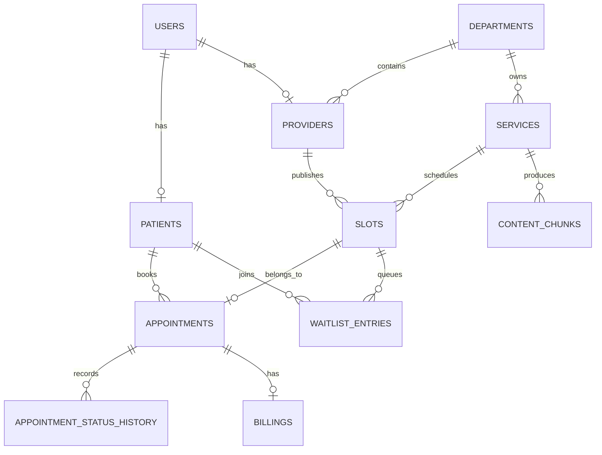
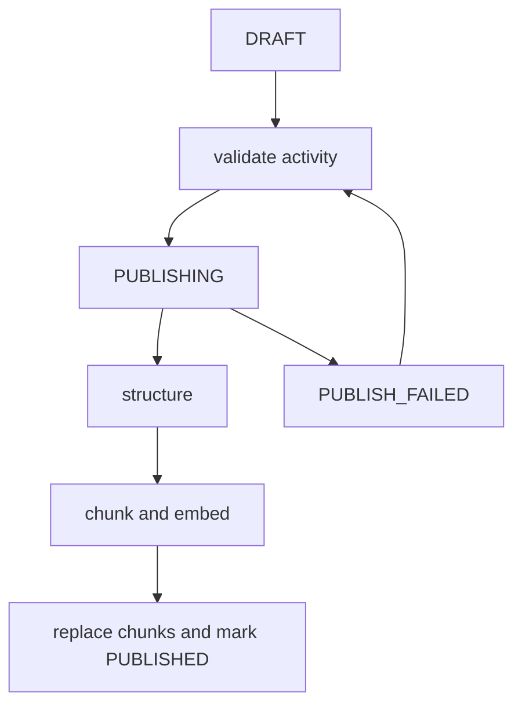
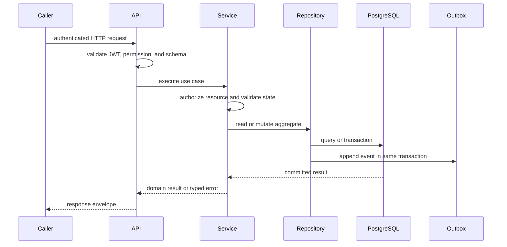

# SmartHealth Design

## Module breakdown

- `app/api`: FastAPI routes, authentication dependencies, authorization, and HTTP contracts.
- `app/core`: settings, JWT security, structured logging, correlation IDs, exceptions, metrics, and Redis idempotency.
- `app/db`: SQLAlchemy engine/session and declarative base.
- `app/models`: users, patients, providers, departments, services, slots, appointments, billing, waitlist, audit, content, and analytics tables.
- `app/schemas`: Pydantic request and response contracts.
- `app/repositories`: database operations and transaction boundaries. Business writes are centralized here.
- `app/services`: application services for billing, analytics, service management, and events.
- `app/workers/temporal`: Temporal workflows, activities, and runtime adapters.
- `app/workers/celery`: retryable tasks and transactional outbox publication.
- `app/workers/kafka`: producers, serializers, consumers, and idempotent handlers.
- `app/events`: broker-neutral event envelopes and correlation metadata.

## Data model



`AuditLog` records entity, action, before/after metadata, and actor ID for provider, service, slot, and appointment mutations. It is added through repositories in the same transaction as the business mutation.

## Service publishing workflow

`DRAFT -> PUBLISHING -> PUBLISHED`. An incomplete service is marked `PUBLISH_FAILED` and returns all validation errors. Temporal activities validate completeness, structure operational text, chunk description and preparation instructions, generate embeddings, replace the service chunks, and mark the service published. The unique `(service_id, chunk_index)` constraint and replacement operation prevent duplicate chunks after retries.



## Scheduling saga

The booking workflow creates a `REQUESTED` appointment, atomically changes the slot to `RESERVED`, records `SLOT_RESERVED`, runs the billing checker, schedules a reminder, and records `CONFIRMED`. Any failure after reservation releases the slot and changes the pending appointment to `CANCELLED`; history is retained.

The consistency boundary is:

```sql
UPDATE slots
SET status = 'RESERVED', patient_id = :patient_id
WHERE id = :slot_id AND status = 'AVAILABLE';
```

The affected-row count is the result. A select-then-update races because two transactions can both observe `AVAILABLE` before either writes. Rescheduling uses the same conditional claim for the replacement slot before releasing the old slot, and rolls back if the new slot was already claimed.

Redis idempotency is keyed by authenticated user and `Idempotency-Key`. The appointment unique slot constraint and atomic reservation protect the database during concurrent requests.

## Key tradeoffs

- PostgreSQL is the production database because conditional updates, unique constraints, and pgvector are first-class requirements. SQLite remains useful for fast tests and migration checks.
- Domain changes and outbox rows are committed together. A broker outage creates measurable delivery lag without rolling back committed business data.
- Temporal owns durable orchestration and retries. Workflows remain deterministic; activities adapt to services, services own business rules, and repositories own database access.
- Repository-level writes centralize consistency and audit behavior at the cost of more explicit application code.
- The local fallback supports development without Temporal; Compose starts the real Temporal worker.

## Temporal Layering

The Temporal worker structure lives under `app/workers/temporal/`.
Workflows contain deterministic orchestration, activities are thin adapters,
services contain business logic, and repositories contain SQLAlchemy data access.

## End-to-End Request Contract



HTTP sessions are synchronous and request-scoped. Services own business transactions; repositories do not call external providers. A workflow or task invokes the same service rules through a thin adapter rather than duplicating them.

## Invariants and Failure Ownership

| Invariant | Enforcement | Recovery owner |
| --- | --- | --- |
| One active reservation per slot | Conditional SQL update and database constraints | Appointment service |
| One outcome per idempotency key | Redis key plus durable booking key | Appointment service |
| Valid visit progression | Service state machine and status history | Visit/appointment service |
| No orphan published content | Atomic chunk replacement and publication status | Service publish workflow |
| No duplicate projection | Processed event ID uniqueness | Kafka consumer |
| No cross-patient access | Permission policies and scoped repositories | API and service layers |
| No unsafe AI answer | Safety gate before retrieval/model calls | Assistant service |

## Operational State Ownership

PostgreSQL owns users, profiles, catalog, slots, appointments, billing, visits, notifications, waitlists, audits, outbox rows, AI interactions, and analytics projections. Redis owns expiring coordination state. Temporal owns workflow history. Kafka carries transport copies of committed events. Rebuilding a cache, projection, or workflow activity must never become the source of domain truth.
