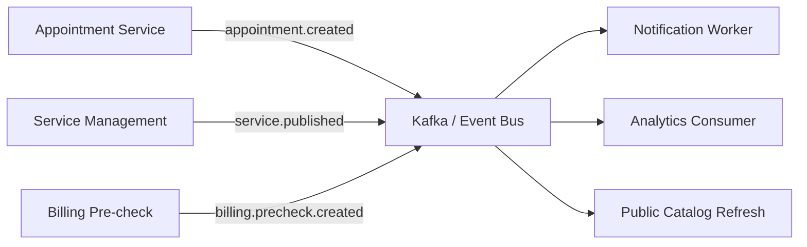
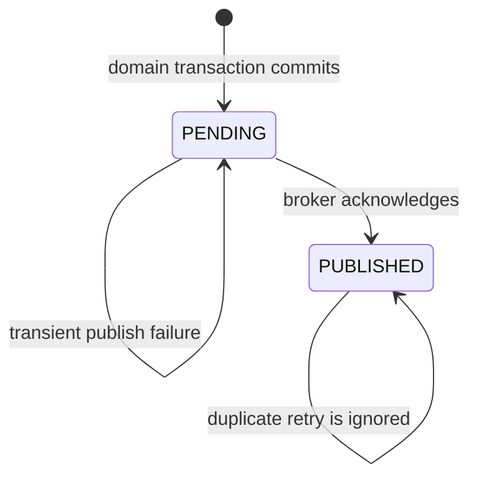
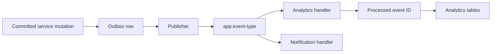

# Event Contracts and Integration Guide

## Overview

SmartHealth emits and consumes domain events to support asynchronous workflows, notification delivery, analytics processing, and event-driven integrations. This document defines the canonical event model and the operational expectations for event producers and consumers.

The system uses a combination of internal service events and asynchronous messaging patterns through Kafka and Celery. Event payloads are intentionally limited to operational metadata and must never contain PHI or personally identifiable user data beyond the minimum required identifiers.

## Event Principles

- events are immutable records of meaningful business changes
- event names are descriptive and business-oriented
- payloads are minimal and safe for operational telemetry
- consumers are expected to perform idempotent handling
- failures should be retried or logged to the failed-job mechanism
- PII/PHI is not included in event payloads

## Event Envelope

Every published event is JSON with this shape. Identifiers are included for correlation; patient names, contact details, diagnoses, and other PHI are excluded.

```json
{
  "event_id": "uuid",
  "event_type": "appointment.created",
  "occurred_at": "2026-08-21T10:30:00Z",
  "version": 1,
  "schema_version": 1,
  "source": "smarthealth-api",
  "entity_type": "appointment",
  "entity_id": "101",
  "correlation_id": "correlation-id",
  "data": {
    "appointment_id": 101,
    "patient_id": 23,
    "provider_id": 7,
    "service_id": 14,
    "slot_id": 55,
    "status": "CONFIRMED"
  }
}
```

The implementation also keeps safe identifier fields at the top level for backward-compatible analytics consumption. Topics use the form `app.<event_type>`.

## Event Catalog

### appointment.created

Producer:
- appointment booking workflow / service layer

Trigger:
- a patient appointment is successfully created

Payload:
- appointment_id
- patient_id
- provider_id
- service_id
- slot_id
- status
- timestamp

Implementation: `POST /api/v1/appointments` after the saga commits the appointment.

Usage:
- downstream reminder processing
- analytics aggregation
- operational dashboards

---

### appointment.cancelled

Producer:
- appointment cancellation flow

Trigger:
- an appointment is cancelled successfully

Payload:
- appointment_id
- patient_id
- provider_id
- slot_id
- status
- timestamp

Implementation: `POST /api/v1/appointments/{id}/cancel` after the repository transaction commits.

Usage:
- slot release notifications
- analytics and operational reporting

---

### appointment.visit_status_changed

Producer:
- appointment service visit transition flow

Trigger:
- a visit status changes, such as CHECKED_IN, IN_PROGRESS, or COMPLETED

Payload:
- appointment_id
- patient_id
- provider_id
- service_id
- slot_id
- status
- visit_status
- timestamp

Implementation: visit transition service after a validated status change.

Usage:
- provider workflow updates
- operational monitoring
- visit analytics

---

### service.published

Producer:
- service publish workflow

Trigger:
- a service is successfully published

Payload:
- service_id
- department_id
- provider_id
- status
- timestamp

Implementation: `mark_published` Temporal activity after chunks and service status commit.

Usage:
- public catalogue refresh
- search/index synchronization
- internal service indexing

---

### service.unpublished

Producer:
- service management flow

Trigger:
- a published service is withdrawn from public access

Payload:
- service_id
- department_id
- provider_id
- status
- timestamp

Implementation: service management after the unpublish transaction commits.

Usage:
- public catalogue updates
- downstream cache invalidation

---

### billing.precheck.created

Producer:
- appointment billing pre-check step

Trigger:
- a billing pre-check is created for a booking

Payload:
- appointment_id
- billing_id
- status
- amount
- timestamp

Implementation: billing pre-check endpoint after the billing row commits.

Usage:
- billing pipeline processing
- financial reconciliation

---

### notification.scheduled

Producer:
- notification service after a reminder or confirmation record commits

Payload:
- notification_id
- appointment_id
- user_id
- notification type
- status
- timestamp

Usage:
- notification lifecycle tracking
- operational analytics

---

### waitlist.joined and waitlist.promoted

Producer:
- waitlist service when a patient joins a full slot or is promoted after release

Payload:
- waitlist_id
- patient_id
- slot_id
- status
- timestamp

Usage:
- queue operations and analytics. Promotion must not bypass the atomic slot reservation rule.

## Event Flow Model



## Idempotency and failure behavior

- emit a single event per meaningful business outcome
- include only required identifiers and safe status values
- log correlation IDs with each emitted event
- `event_id` is a UUID and the analytics consumer records it in `analytics_processed_events` with a unique constraint before applying rollups.
- Replaying the same event is ignored, so counters are not incremented twice.
- Kafka delivery failures are logged after the database commit and do not undo a successful domain mutation.
- Celery task failures are bounded by retry policies and recorded in `failed_jobs`.

## Transactional Outbox Lifecycle



The outbox publisher claims pending rows without changing their event identity. It publishes the stored envelope, then marks the row `PUBLISHED` with its publication timestamp. A crash between publication and marking can cause a broker redelivery; consumers must therefore deduplicate by `event_id`.

## Contract Versioning

Consumers must accept the declared `schema_version`, reject unsupported breaking versions, and tolerate additive fields. A changed meaning, removed field, or changed identifier semantics requires a new schema version and compatibility tests. Event IDs are globally unique per emitted outcome and are never regenerated during retry.

## Event-to-Projection Flow



## Consumer Responsibilities

- validate payload integrity before processing
- treat processing as idempotent where possible
- record failures with task/job metadata
- use correlation ID to trace request and workflow lineage
- avoid exposing sensitive data in consumer logs

## Operational Controls

### Retry and failure handling

- Celery task failures are tracked through the failed job service
- event processing failures should be logged with stack trace and metadata
- retries must be bounded and follow backoff policies

### Observability

Each event path should include:
- correlation_id
- request_id
- task_id or workflow_id
- event name
- timestamp
- result or failure status

## Security Notes

- never emit PHI or raw patient contact data in event payloads
- keep business identifiers at the minimum required for downstream processing
- protect event topic access using infrastructure-level credentials
- use environment-specific topics for dev, staging, and prod

## Recommended Standards

- use clear business names, not implementation names
- keep events versioned when contract changes are necessary
- document event contract changes in release notes
- add schema validation before production usage for critical event channels

## Related Documentation

- [design.md](design.md)
- [STRUCTURED_LOGGING.md](STRUCTURED_LOGGING.md)
- [runbook.md](runbook.md)
